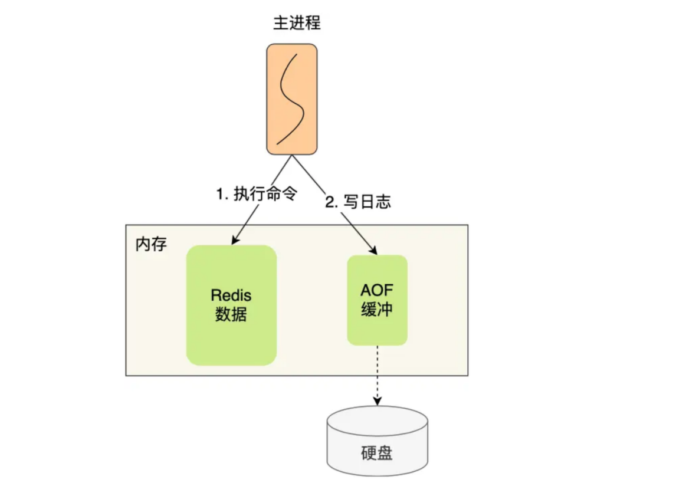
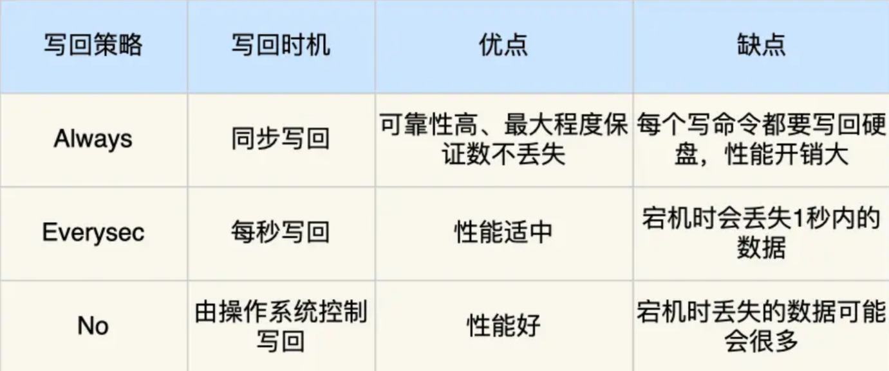
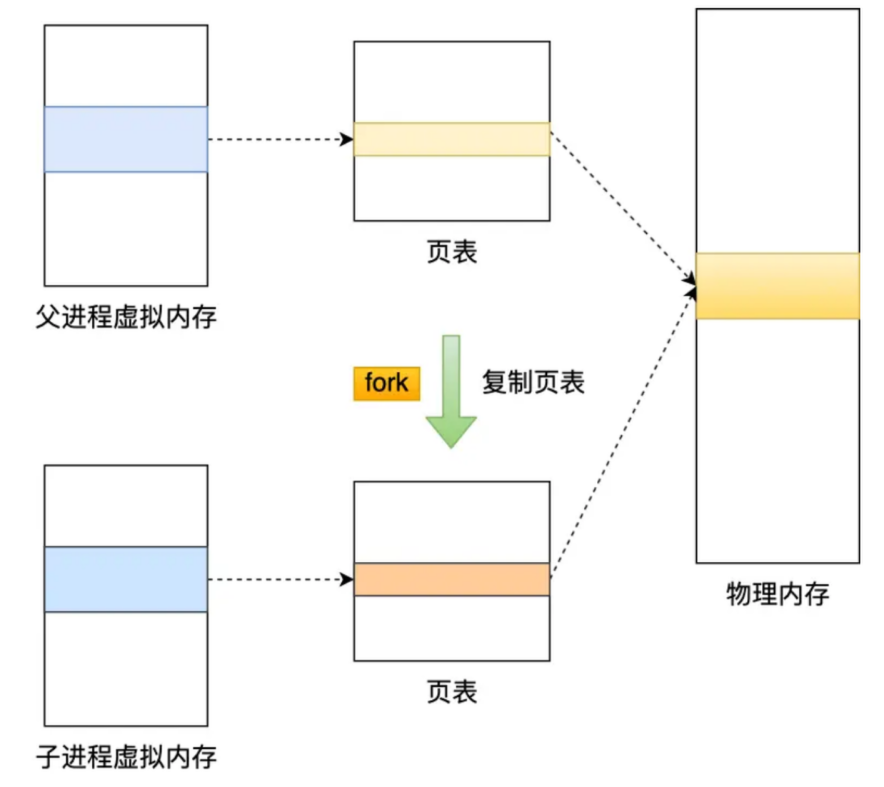
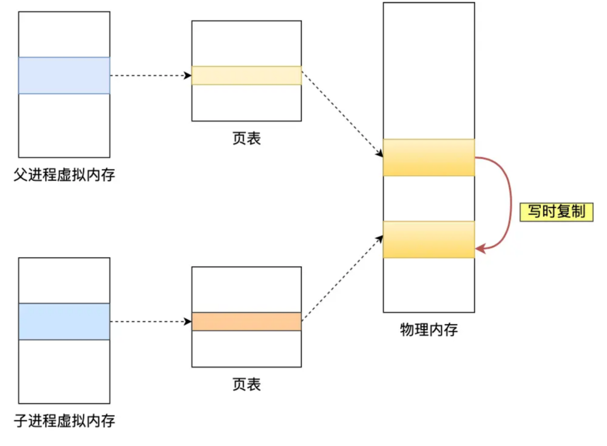

# Redis
----

#### 问：键值对是如何保存在 Redis 中的呢？

Redis 是使用了一个`哈希表`保存所有键值对，哈希表的最大好处就是让我们可以用 O(1) 的时间复杂度来快速查找到键值对。
哈希表其实就是一个数组，数组中的元素叫做哈希桶。

#### 问：Redis 的哈希桶是怎么保存键值对数据的呢？

哈希桶存放的是指向键值对数据的指针，通过指针就能找到键值对数据。
键值对的数据结构中保存了` void * key `和` void * value `指针，分别指向了实际的键对象和值对象

## AOF持久化(默认关闭)

Redis 每执行一条`写操作`命令，就把该命令以追加的方式写入到一个文件里，重启 Redis 的时候，先去读取这个文件里的命令并且执行它，就相当于恢复了缓存数据。
只会记录写操作命令，读操作命令不会被记录。

#### Redis 是先执行写操作命令后，才将该命令记录到 AOF 日志里

优点：

- 避免额外的检查开销

    在该命令执行成功后，才将命令记录到 AOF 日志

- 不会阻塞当前写操作命令的执行

#### AOF 持久化潜在风险

- 执行写操作命令和记录日志是两个过程，当 Redis 没来得及将命令写入到硬盘时，服务器宕机，这个数据就会有`丢失的风险`。

- 写操作命令执行成功后才记录到 AOF 日志，所以不会阻塞当前写操作命令的执行，但是可能会给下一个命令带来`阻塞风险`。因为将命令写入到日志的这个操作也是在主进程完成的（执行命令也是在主进程），这两个操作是同步的。



两个风险都有一个共性，都跟`「 AOF 日志写回硬盘的时机」`有关

#### 三种写回策略



三种策略只是在控制 fsync() 函数的调用时机

- `Always` 策略就是每次写入 AOF 文件数据后，就执行 fsync() 函数；
- `Everysec` 策略就会创建一个异步任务来执行 fsync() 函数；
- `No` 策略就是永不执行 fsync() 函数;

### AOF 重写机制

当 AOF 文件的大小超过所设定的阈值后，Redis 就会启用 AOF 重写机制，来压缩 AOF 文件。

AOF 重写机制是在重写时，读取当前数据库中的所有键值对，然后将每一个键值对用一条命令记录到新的 AOF 文件，等到全部记录完后，就将新的 AOF 文件替换掉现有的 AOF 文件。

只需要根据键值对当前的最新状态，然后用一条命令去记录键值对，代替之前记录这个键值对的多条命令这样就减少了 AOF 文件中的命令数量。

#### 问：为什么重写AOF的时候，不直接复用现有的AOF文件，而是先写到新的AOF文件再覆盖过去?

如果 AOF 重写过程中失败了，现有的 AOF 文件就会造成污染，可能无法用于恢复使用。

### AOF 后台重写

写入 AOF 日志的操作虽然是在主进程完成的，因为它写入的内容不多，所以一般不太影响命令的操作。

但是在触发 AOF 重写时，这个过程是很耗时的，所以重写的操作不能放在主进程里。

Redis 的重写 AOF 过程是由后台子进程 bgrewriteaof 来完成的，这么做有两个好处：

- 子进程进行 AOF 重写期间，主进程可以继续处理命令请求，从而避免阻塞主进程；
- 子进程带有主进程的数据副本, 使用子进程而不是线程(如果是使用线程，多线程之间会共享内存，那么在修改共享内存数据的时候，需要通过加锁来保证数据的安全，而这样就会降低性能), 使用子进程，创建子进程时，父子进程是共享内存数据的，不过这个共享的内存只能以只读的方式，而当父子进程任意一方修改了该共享内存，就会发生写时复制，于是父子进程就有了独立的数据副本，就不用加锁来保证数据安全。

#### 问：子进程是怎么拥有主进程一样的数据副本的呢？

主进程在通过 fork 系统调用生成 bgrewriteaof 子进程时，操作系统会把主进程的页表复制一份给子进程，这个页表记录着虚拟地址和物理地址映射关系，而不会复制物理内存，也就是说，两者的虚拟空间不同，但其对应的物理空间是同一个。



这样一来子进程就共享了父进程的物理内存数据了，这样能够`节约物理内存资源`，页表对应的页表项的属性会标记该物理内存的权限为`只读`。

### 写时复制
当父进程或者子进程在向这个内存发起写操作时，CPU 就会触发写保护中断，然后操作系统会在「写保护中断处理函数」里进行物理内存的复制，并重新设置其内存映射关系，将父子进程的内存读写权限设置为可读写，最后才会对内存进行写操作，这个过程被称为`写时复制(Copy On Write)`



写时复制顾名思义，在发生写操作的时候，操作系统才会去复制物理内存。
这样是为了防止 fork 创建子进程时，由于物理内存数据的复制时间过长而导致父进程长时间阻塞的问题。

#### 阻塞父进程的两个阶段：

- 创建子进程的途中，由于要复制父进程的页表等数据结构，阻塞的时间跟页表的大小有关，页表越大，阻塞的时间也越长；
- 创建完子进程后，如果子进程或者父进程修改了共享数据，就会发生写时复制，这期间会拷贝物理内存，如果内存越大，自然阻塞的时间也越长；

####  AOF 重写缓冲区

触发重写机制后，主进程就会创建重写 AOF 的子进程，此时父子进程共享物理内存，重写子进程只会对这个内存进行只读，重写 AOF 子进程会读取数据库里的所有数据，并逐一把内存数据的键值对转换成一条命令，再将命令记录到重写日志（新的 AOF 文件）。

但是子进程重写过程中，主进程依然可以正常处理命令。

如果此时主进程修改了已经存在 key-value，就会发生写时复制，注意只会复制主进程修改的物理内存数据，没修改物理内存还是与子进程共享的。

所以如果这个阶段修改数据量比较大的 k-v 的时候，这时复制的物理内存数据的过程就会比较耗时，有阻塞主进程的风险。

重写 AOF 日志过程中，如果主进程修改了已经存在 k-v，此时这个 k-v 数据在子进程的内存数据就跟主进程的内存数据不一致。

为了解决这种数据不一致问题，Redis 设置了一个 `AOF 重写缓冲区`，这个缓冲区在创建 bgrewriteaof 子进程之后开始使用。

在整个 AOF 后台重写过程中，除了发生`写时复制`会对主进程造成阻塞，还有`信号处理`函数执行时也会对主进程造成阻塞，在其他时候AOF 后台重写都不会阻塞主进程。

## RDB 快照(默认开启)

AOF 日志和 RDB 快照这两种技术都会用各用一个日志文件来记录信息，但是记录的内容是不同的：

- AOF 文件的内容是操作命令；
- RDB 文件的内容是二进制数据。

Redis 提供了两个命令来生成 RDB 文件，分别是 save 和 bgsave，他们的区别就在于是否在「主线程」里执行：c

- `save` 命令，会在主线程生成 RDB 文件，由于和执行操作命令在同一个线程，所以如果写入RDB 文件的时间太长，会阻塞主线程；
- `bgsave` 命令，会创建一个子进程来生成 RDB 文件，这样可以避免主线程的阻塞；

RDB 文件的加载工作是在服务器启动时自动执行的，Redis 并没有提供专门用于加载 RDB 文件的命令。

Redis 的快照是`全量快照`，也就是说每次执行快照，都是把内存中的所有数据都记录到磁盘中。

#### 执行快照时，数据能被修改吗？

执行 bgsave 过程中，Redis 依然可以继续处理操作命令

关键的技术就在于写时复制技术

### 写时复制技术

创建 bgsave 子进程后，由于共享父进程的所有内存数据，于是就可以直接读取主线程里的内存数据，并将数据写入到 RDB 文件。

当主线程对这些共享的内存数据也都是只读操作，那么 主线程 和 bgsave 子进程相互不影响。

但如果主线程要修改共享数据里的某一块数据时，就会发生写时复制，于是这块数据的物理内存就会被复制一份，然后主线程在这个数据副本进行修改操作。与此同时，bgsave 子进程可以继续把原来的数据写入到 RDB 文件。

bgsave 快照过程中，如果主线程修改了共享数据，发生了写时复制后，RDB 快照保存的是原本的内存数据，而主线程刚修改的数据，是没办法在这一时间写入 RDB 文件的，只能交由下一次的 bgsave 快照。

极端情况下，如果所有的共享内存都被修改，则此时的内存占用是原先的 2 倍。

## RDB 和 AOF 合体

尽管 RDB 比 AOF 的数据恢复速度快，但是快照的频率不好把握：

- 频率太低，两次快照间一旦服务器发生宕机，就可能会比较多的数据丢失；
- 频率太高，频繁写入磁盘和创建子进程会带来额外的性能开销。

混合使用 AOF 日志和内存快照，也叫混合持久化。
```shell
aof-use-rdb-preamble yes
```

混合持久化工作在 AOF 日志重写过程。

使用了混合持久化，AOF 文件的前半部分是 RDB 格式的全量数据，后半部分是 AOF 格式的增量数据。

好处在于重启 Redis 加载数据的时候，由于前半部分是 RDB 内容，这样加载的时候速度会很快。加载完 RDB 的内容后，才会加载后半部分的 AOF 内容，这里的内容是 Redis 后台子进程重写 AOF 期间，主线程处理的操作命令，可以使得数据更少的丢失。

