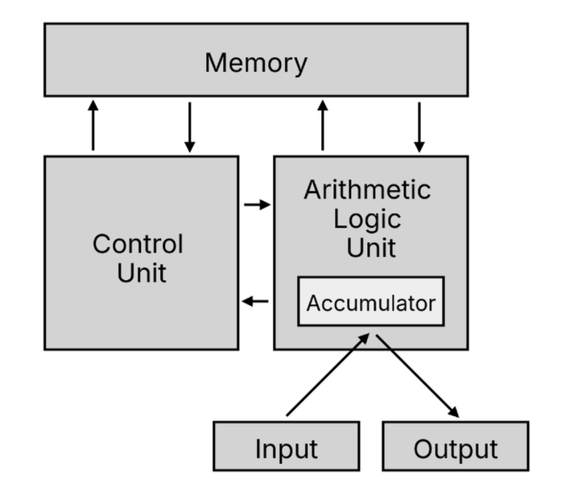

### 冯诺依曼模型

运算器、控制器、存储器、输入设备、输出设备

### 内存

存储数据的基本单位是字节,每一个字节都对应一个内存地址。程序和数据都是存储在内存，存储的区域是线性的。

### 中央处理器/CPU

CPU 内部还有一些组件，有寄存器、控制单元和逻辑运算单元等。

### 总线

总线是用于 CPU 和内存以及其他设备之间的通信

- 地址总线，用于指定 CPU 将要操作的内存地址
- 数据总线，用于读写内存的数据
- 控制总线，用于发送和接收信号(中断)

###  线路位宽与 CPU 位宽

- 线路位宽:数据/地址总线一次传输或寻址的位数
- CPU 位宽:CPU 内部能处理数据的宽度

