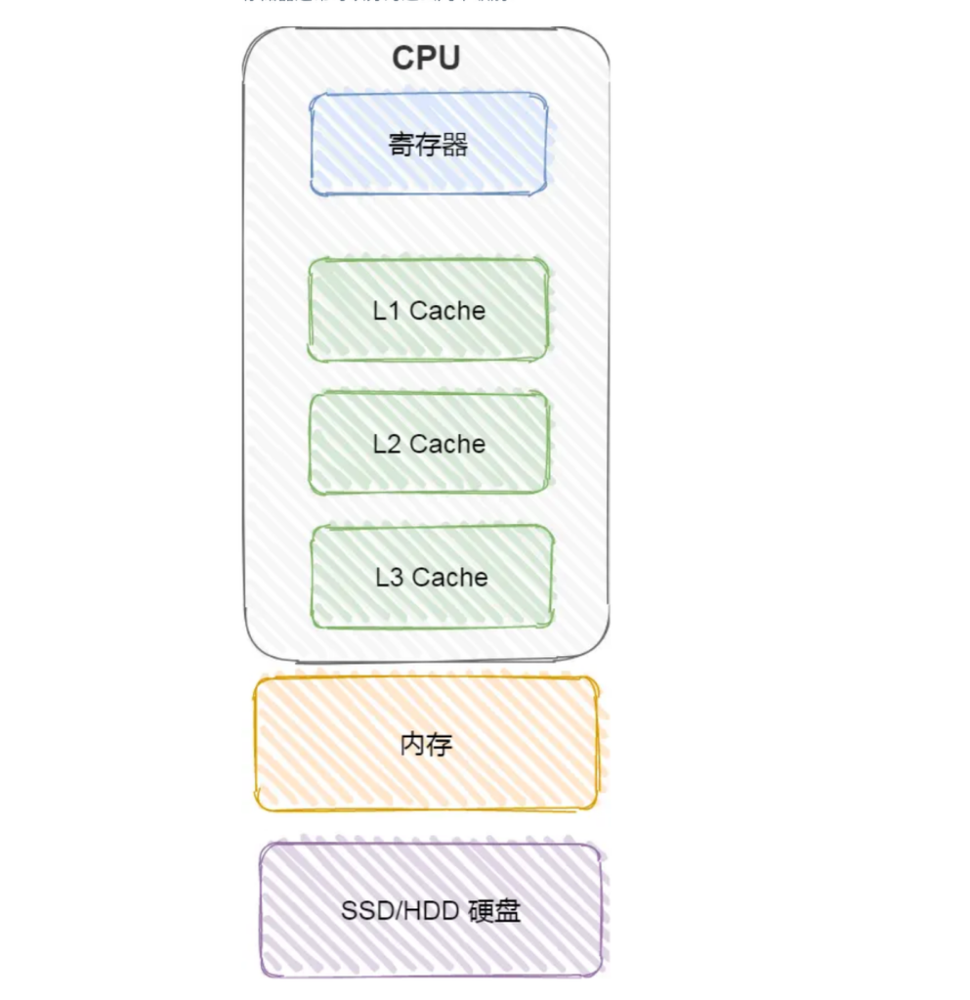
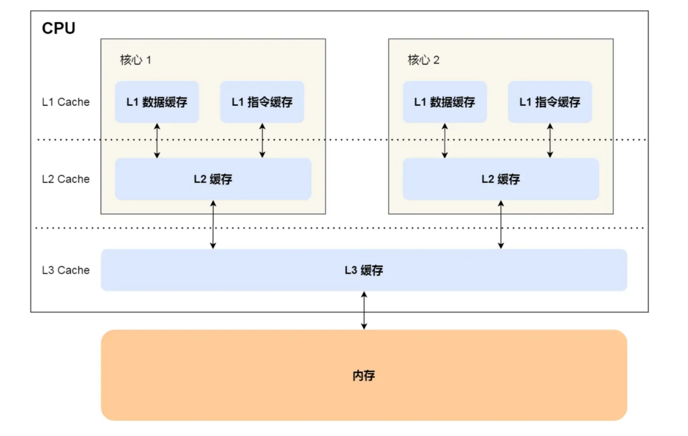
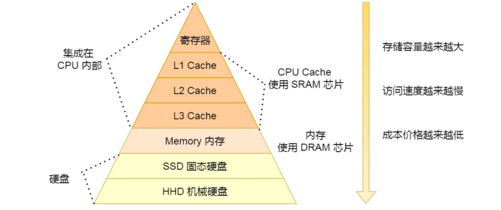

### 对于存储器，它的速度越快、能耗会越高、而且材料的成本也是越贵的，以至于速度快的存储器的容量都比较小。

# 寄存器

最靠近 CPU 的控制单元和逻辑计算单元的存储器，就是寄存器

# CPU Cache

CPU Cache 用的是一种叫SRAM（静态随机存储器）的芯片(断电丢失)

CPU 的高速缓存，通常可以分为 L1、L2、L3 这样的三层高速缓存，也称为一级缓存、二级缓存、三级缓存。

# 内存

内存用的是一种叫作 DRAM（动态随机存取存储器）的芯片(需要定时刷新电容，数据不会丢失)

# SSD/HDD 硬盘

- SSD:固体硬盘
- HDD:机械硬盘

每个存储器只和相邻的一层存储器设备打交道，并且存储设备为了追求更快的速度，所需的材料成本必然也是更高，
也正因为成本太高，所以 CPU 内部的寄存器、L1\L2\L3 Cache 只好用较小的容量，相反内存、硬盘则可用更大的容量
