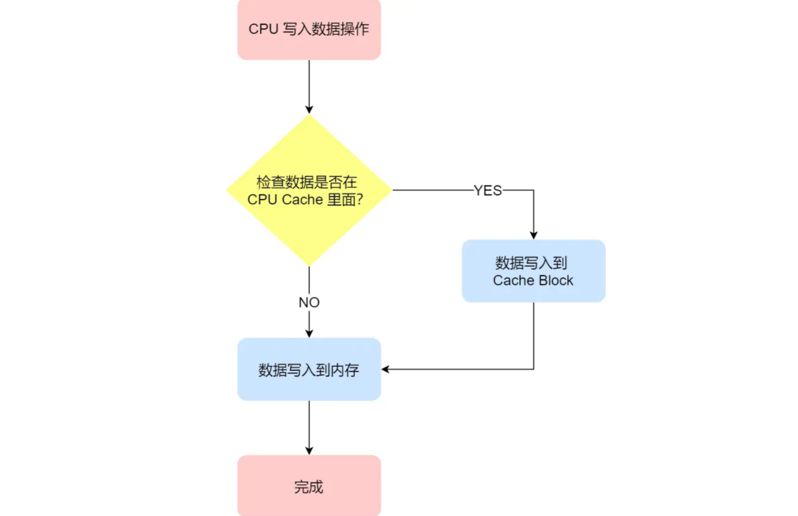
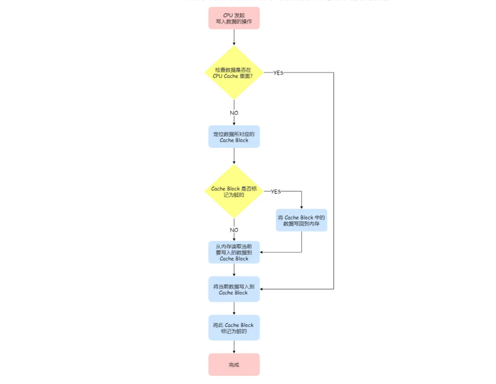

# CPU Cache 的数据写入

CPU Cache 是由很多个 Cache Line 组成的，CPU Line 是 CPU 从内存读取数据的基本单位，而 CPU Line 是由各种标志（Tag）+ 数据块（Data Block）组成

### 写直达(把数据同时写入内存和 Cache 中)

缺点：无论数据在不在 Cache 里面，每次写操作都会写回到内存，性能会受到很大的影响

### 写回(更高性能)

当发生写操作时，新的数据仅仅被写入 Cache Block 里，只有当修改过的 Cache Block「被替换」时才需要写到内存中

# 缓存一致性

现在 CPU 都是多核的，由于 L1/L2 Cache 是多个核心各自独有的，那么会带来多核心的缓存一致性（Cache Coherence） 的问题

### 1.写传播

- 某个 CPU 核心里的 Cache 数据更新时，必须要传播到其他核心的 Cache

实现方式：

- `总线嗅探`：CPU 需要每时每刻监听总线上的一切活动，但是不管别的核心的 Cache 是否缓存相同的数据，都需要发出一个广播事件，这无疑会加重总线的负载。

- `MESI 协议`:Modified，已修改/Exclusive，独占/Shared，共享/Invalidated，已失效

这四个状态来标记 Cache Line 四个不同的状态。

当 Cache Line 状态是「已修改」或者「独占」状态时，修改更新其数据不需要发送广播给其他 CPU 核心，这在一定程度上减少了总线带宽压力。

### 2.事务串行化 

- 某个 CPU 核心里对数据的操作顺序，必须在其他核心看起来顺序是一样

实现方式：

- CPU 核心对于 Cache 中数据的操作，需要同步给其他 CPU 核心

- 「锁」