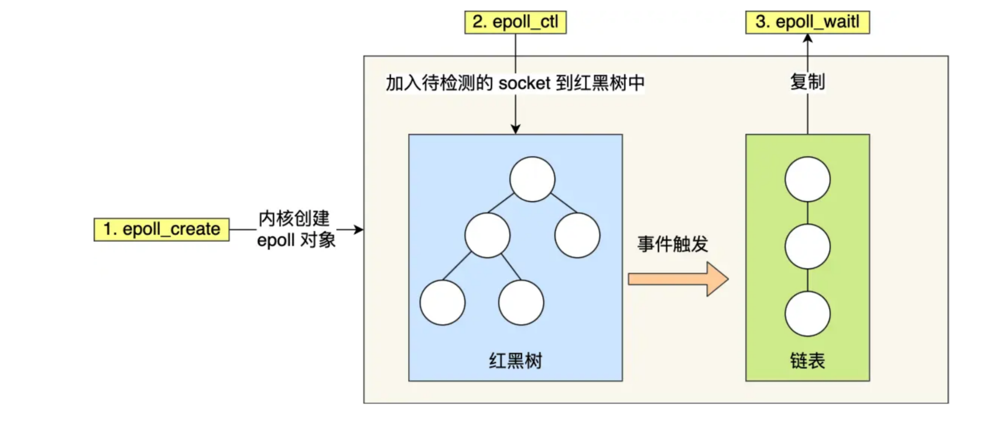

# select / poll

将已连接的 Socket 都放到一个文件描述符集合（固定长度的 BitsMap/0~1024），然后调用 select 函数将文件描述符集合拷贝到内核里，
通过遍历文件描述符集合的方式，当检查到有事件产生后，将此 Socket 标记为可读或可写，接着再把整个文件描述符集合拷贝回用户态里，
然后用户态还需要再通过遍历的方法找到可读或可写的 Socket，然后再对其处理。对于 select 这种方式，需要进行 2 次「遍历」文件描述符集合，
一次是在内核态里，一个次是在用户态里 ，而且还会发生 2 次「拷贝」文件描述符集合，先从用户空间传入内核空间，由内核修改后，再传出到用户空间中。

poll 不用 BitsMap 来存储所关注的文件描述符，取而代之用动态数组，以链表形式来组织，突破了 select 的文件描述符个数限制，当然还会受到系统文件描述符限制。

但是 poll 和 select 并没有太大的本质区别，都是使用「线性结构」存储进程关注的 Socket 集合，因此都需要遍历文件描述符集合来找到可读或可写的 Socket，
时间复杂度为 O(n)，而且也需要在用户态与内核态之间拷贝文件描述符集合，这种方式随着并发数上来，性能的损耗会呈指数级增长。

# epoll

```c
int s = socket(AF_INET, SOCK_STREAM, 0);
bind(s, ...);
listen(s, ...)

int epfd = epoll_create(...);
epoll_ctl(epfd, ...);//将所有需要监听的socket添加到epfd中

while(1){
    int n = epoll_wait(...);
    for(接收到数据的socket){
        //todo
    }
}
```

### 1.红黑树

epoll 在内核里使用`红黑树`来跟踪进程所有待检测的文件描述字，把需要监控的 socket 通过 epoll_ctl() 函数加入内核中的红黑树里，
红黑树是个高效的数据结构，增删改一般时间复杂度是 O(logn)。

### 2.事件驱动

epoll 使用事件驱动的机制，内核里维护了一个链表来记录就绪事件，当某个 socket 有事件发生时，通过回调函数内核会将其加入到这个就绪事件列表中，
当用户调用 epoll_wait() 函数时，只会返回有事件发生的文件描述符的个数，不需要像 select/poll 那样轮询扫描整个 socket 集合，大大提高了检测的效率。



### 边缘触发（ET）

当被监控的 Socket 描述符上有可读事件发生时，服务器端只会从 epoll_wait 中苏醒一次

### 水平触发（LT）

当被监控的 Socket 上有可读事件发生时，服务器端不断地从 epoll_wait 中苏醒，直到内核缓冲区数据被 read 函数读完才结束

# !阻塞、非阻塞、同步、异步 I/O

### 同步I/O:

无论 read 和 send 是阻塞 I/O，还是非阻塞 I/O 都是同步调用。在 read 调用时，内核将数据从内核空间拷贝到用户空间的过程都是需要等待的

### 异步 I/O:

「内核数据准备好」和「数据从内核态拷贝到用户态」这两个过程都不用等待

当我们发起 aio_read （异步 I/O） 之后就立即返回，内核自动将数据从内核空间拷贝到用户空间，这个拷贝过程同样是异步的，内核自动完成的，应用程序并不需要主动发起拷贝动作。

### 阻塞 I/O:

用户程序执行 read ，线程会被阻塞，一直等到内核数据准备好，并把数据从内核缓冲区拷贝到应用程序的缓冲区中，当拷贝过程完成，read 才会返回。

阻塞等待的是「内核数据准备好」和「数据从内核态拷贝到用户态」这两个过程。

### 非阻塞 I/O:

read 请求在数据未准备好的情况下立即返回，可以继续往下执行，此时应用程序不断轮询内核，直到数据准备好，内核将数据拷贝到应用程序缓冲区，
read 调用才可以获取到结果。

# Reactor 模式

非阻塞同步网络模式，感知的是就绪可读写事件

I/O 多路复用监听事件，收到事件后，根据事件类型分配（Dispatch）给某个进程 / 线程。

Reactor模式主要由 Reactor 和处理资源池这两个核心部分组成:

- Reactor 负责监听和分发事件，事件类型包含连接事件、读写事件；
- 处理资源池负责处理事件，如 read -> 业务逻辑 -> send；
  
# Proactor 模式

异步网络模式， 感知的是已完成的读写事件