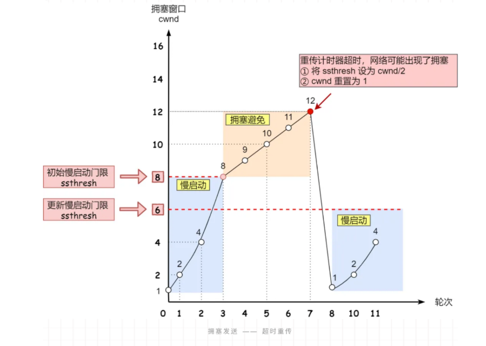
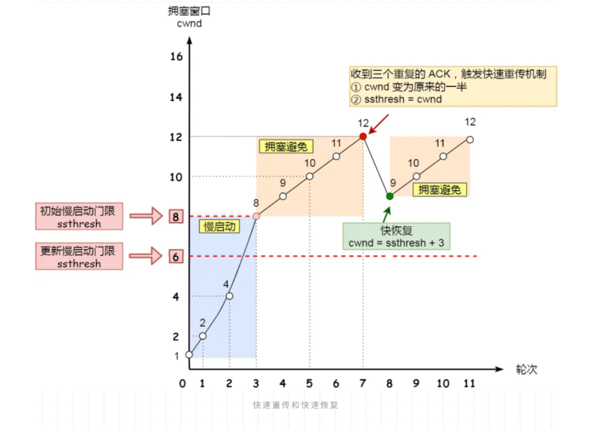

### TCP如何实现可靠传输

#### 重传机制

TCP 实现可靠传输的方式之一，是通过序列号与确认应答。

针对数据包丢失的情况，会用重传机制解决。

- 超时重传:

TCP 会在以下两种情况发生超时重传：

    数据包丢失 / 确认应答丢失

`RTT` 就是包的往返时间，超时重传时间 `RTO` :

1.当超时时间 RTO 较大时，重发就慢，丢了老半天才重发，没有效率，性能差；

2.当超时时间 RTO 较小时，会导致可能并没有丢就重发，于是重发的就快，会增加网络拥塞，导致更多的超时，更多的超时导致更多的重发。

超时重传时间 RTO 的值应该略大于报文往返  RTT 的值。

- 快速重传

不以时间为驱动，而是以数据驱动重传。

当收到三个相同的 ACK 报文时，会在定时器过期之前，重传丢失的报文段。

面临着另外一个问题。就是重传的时候，是重传之前的一个，还是重传所有的问题，于是就有 SACK 方法。

- SACK

在 TCP 头部「选项」字段里加一个 SACK 的东西，它可以将缓存的地图发送给发送方，这样发送方就可以知道哪些数据收到了，哪些数据没收到，知道了这些信息，就可以只重传丢失的数据。

- D-SACK

主要使用了 SACK 来告诉「发送方」有哪些数据被重复接收了。

#### 滑动窗口

#### 流量控制

TCP 提供一种机制可以让「发送方」根据「接收方」的实际接收能力控制发送的数据量，这就是所谓的流量控制。

#### 拥塞控制

在网络出现拥堵时，如果继续发送大量数据包，可能会导致数据包时延、丢失等，这时 TCP 就会重传数据，但是一重传就会导致网络的负担更重，于是会导致更大的延迟以及更多的丢包，这个情况就会进入恶性循环被不断地放大….拥塞控制，控制的目的就是避免「发送方」的数据填满整个网络。

拥塞控制主要是四个算法：

- 慢启动 

- 拥塞避免 : 当拥塞窗口 cwnd 超过慢启动门限就会进入拥塞避免算法

- 拥塞发生 

发生超时重传的拥塞发生算法:

- 快速恢复 

发生快速重传的拥塞发生算法

