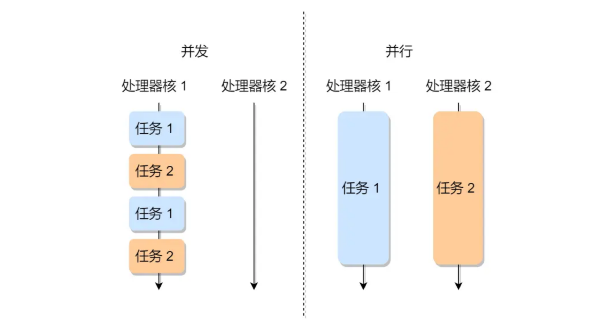
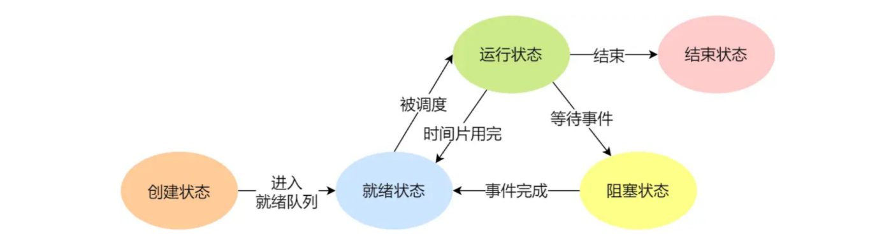
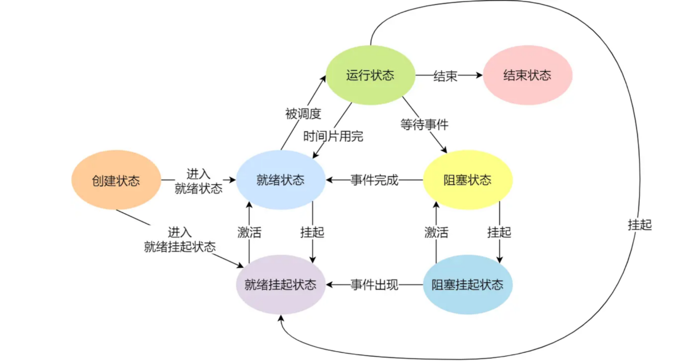

# 进程 - 运行中的程序

并发和并行的区别：

CPU 可以从一个进程切换到另外一个进程，在切换前必须要记录当前进程中运行的状态信息，以备下次切换回来的时候可以恢复执行。

### 进程的状态

- `运行状态`（Running）：该时刻进程占用 CPU；
- `就绪状态`（Ready）：可运行，由于其他进程处于运行状态而暂时停止运行；
- `阻塞状态`（Blocked）：该进程正在等待某一事件发生（如等待输入/输出操作的完成）而暂时停止运行，这时，即使给它CPU控制权，它也无法运行；

- `创建状态`（new）：进程正在被创建时的状态；
- `结束状态`（Exit）：进程正在从系统中消失时的状态；

描述进程没有占用实际的物理内存空间的情况，这个状态就是`挂起状态`,这跟阻塞状态是不一样，阻塞状态是等待某个事件的返回。

- `阻塞挂起状态`：进程在外存（硬盘）并等待某个事件的出现；
- `就绪挂起状态`：进程在外存（硬盘），但只要进入内存，即刻立刻运行；

### PCB/进程控制块

PCB 是进程存在的`唯一`标识

### 进程的上下文切换

一个进程切换到另一个进程运行，称为进程的上下文切换

进程的上下文切换不仅包含了虚拟内存、栈、全局变量等用户空间的资源，还包括了内核堆栈、寄存器等内核空间的资源。

# 线程 - 进程当中的一条执行流程

### 优点
- 一个进程中可以同时存在多个线程
- 各个线程之间可以并发执行
- 各个线程之间可以共享地址空间和文件等资源

### 缺点

- 一个线程崩溃时，会导致其所属进程的所有线程崩溃(c++)

### 比较 - 线程是调度的基本单位，而进程则是资源拥有的基本单位

- 进程是资源（包括内存、打开的文件等）分配的单位，线程是 CPU 调度的单位；
- 进程拥有一个完整的资源平台，而线程只独享必不可少的资源，如寄存器和栈；
- 线程同样具有就绪、阻塞、执行三种基本状态，同样具有状态之间的转换关系；
- 线程能减少并发执行的时间和空间开销；

线程相比进程能减少开销，体现在：

- 线程的创建时间比进程快，因为进程在创建的过程中，还需要资源管理信息，比如内存管理信息、文件管理信息，而线程在创建的过程中，不会涉及这些资源管理信息，而是共享它们；
- 线程的终止时间比进程快，因为线程释放的资源相比进程少很多；
- 同一个进程内的线程切换比进程切换快，因为线程具有相同的地址空间（虚拟内存共享），这意味着同一个进程的线程都具有同一个页表，那么在切换的时候不需要切换页表。
而对于进程之间的切换，切换的时候要把页表给切换掉，而页表的切换过程开销是比较大的；
- 由于同一进程的各线程间共享内存和文件资源，那么在线程之间数据传递的时候，就不需要经过内核了，这就使得线程之间的数据交互效率更高了；

###  线程的上下文切换

- 当两个线程不是属于同一个进程，则切换的过程就跟进程上下文切换一样；
- 当两个线程是属于同一个进程，因为虚拟内存是共享的，所以在切换时，虚拟内存这些资源就保持不动，只需要切换线程的私有数据、寄存器等不共享的数据；

### 线程的实现

- `用户线程`：在用户空间实现的线程，不是由内核管理的线程，是由用户态的线程库来完成线程的管理；
- `内核线程`：在内核中实现的线程，是由内核管理的线程；
- `轻量级线程`：在内核中来支持用户线程；

# 调度

### 调度原则

- CPU 利用率：调度程序应确保 CPU 是始终匆忙的状态，这可提高 CPU 的利用率；
- 系统吞吐量：吞吐量表示的是单位时间内 CPU 完成进程的数量，长作业的进程会占用较长的 CPU 资源，因此会降低吞吐量，相反，短作业的进程会提升系统吞吐量；
- 周转时间：周转时间是进程运行+阻塞时间+等待时间的总和，一个进程的周转时间越小越好；
- 等待时间：这个等待时间不是阻塞状态的时间，而是进程处于就绪队列的时间，等待的时间越长，用户越不满意；
- 响应时间：用户提交请求到系统第一次产生响应所花费的时间，在交互式系统中，响应时间是衡量调度算法好坏的主要标准。

### 调度算法

单核 CPU:

1.先来先服务调度算法

2.最短作业优先调度算法

3.高响应比优先调度算法

4.时间片轮转调度算法

5.最高优先级调度算法

6.多级反馈队列调度算法
