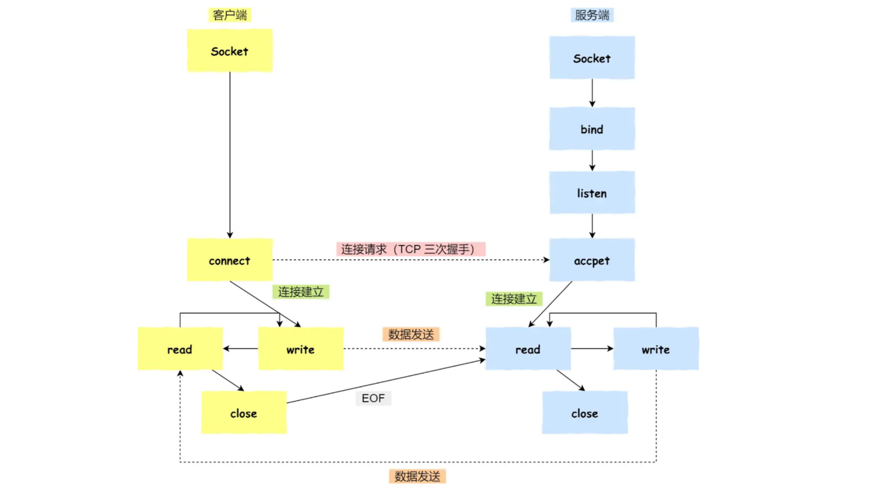
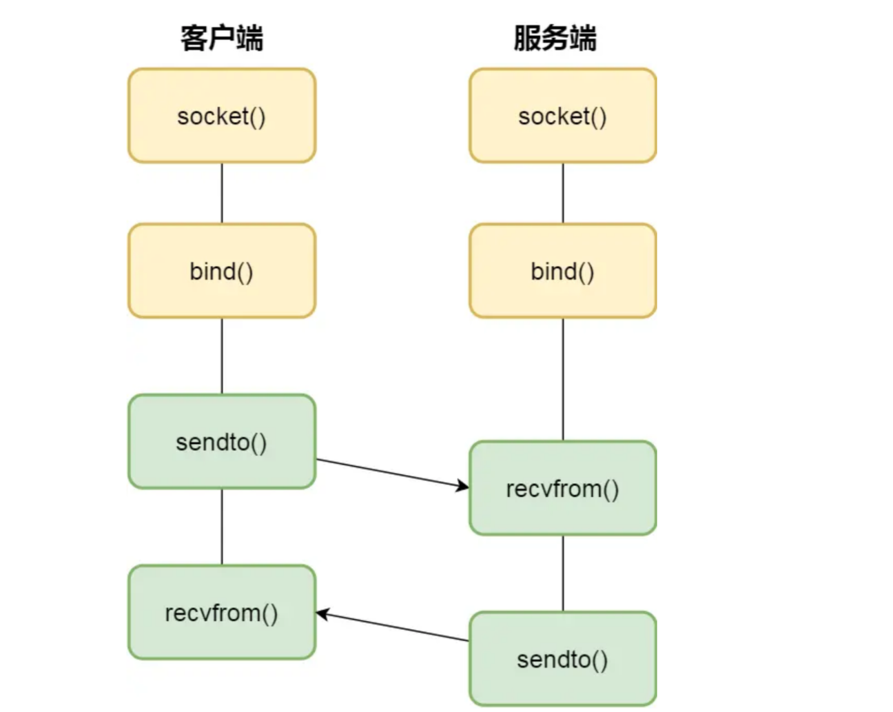

# 管道

管道，就是内核里面的一串缓存。管道这种通信方式效率低，不适合进程间频繁地交换数据

```c
    //管道的创建
    int pipe(int fd[2])
```
表示创建一个匿名管道，并返回了两个描述符，一个是管道的读取端描述符 fd[0]，另一个是管道的写入端描述符 fd[1]

- 对于匿名管道，它的通信范围是存在父子关系的进程
- 对于命名管道，它可以在不相关的进程间也能相互通信

# 消息队列

消息队列是保存在内核中的消息链表，消息队列生命周期随内核

消息队列不适合比较大数据的传输，且通信过程中，存在用户态与内核态之间的数据拷贝开销

# 共享内存

共享内存的机制，就是拿出一块虚拟地址空间来，映射到相同的物理内存中

# 信号量

为了防止多进程竞争共享资源，而造成的数据错乱，所以需要信号量

信号量其实是一个整型的计数器，主要用于实现进程间的互斥与同步，而不是用于缓存进程间通信的数据。

### 控制信号量的方式有两种原子操作：

- `P 操作`:信号量减 1，减后如果信号量 < 0，资源已被占用，进程需阻塞等待；减后如果信号量 >= 0，还有资源可使用，进程可正常继续执行。
- `V 操作`:信号量加 1，加后如果信号量 <= 0，当前有阻塞中的进程，会将该进程唤醒运行；加后如果信号量 > 0，当前没有阻塞中的进程；

P 操作是用在进入共享资源之前，V 操作是用在离开共享资源之后，这两个操作是必须成对出现。

- 信号初始化为 1，就代表着是互斥信号量

- 信号初始化为 0，就代表着是同步信号量

# 信号

对于异常情况下的工作模式，就需要用「信号」的方式来通知进程

- Ctrl+C 产生 SIGINT 信号，表示终止该进程；
- Ctrl+Z 产生 SIGTSTP 信号，表示停止该进程，但还未结束；

信号是异步通信机制，用户进程对信号的处理方式:

1.执行默认操作。

2.捕捉信号。

3.忽略信号。

# Socket

跨网络与不同主机上的进程之间通信

```c
    //创建socket的系统调用
    int socket(int domain, int type, int protocal)
```

- `domain` : 指定协议族，比如 AF_INET 用于 IPV4、AF_INET6 用于 IPV6、AF_LOCAL/AF_UNIX 用于本机；
- `type` : 指定通信特性，比如 SOCK_STREAM 表示的是字节流，对应 TCP、SOCK_DGRAM 表示的是数据报，对应 UDP、SOCK_RAW 表示的是原始套接字；
- `protocal`: 原本是用来指定通信协议的，但现在基本废弃,一般写成 0 即可；

### 针对 TCP 协议通信的 socket 编程模型



- 服务端和客户端初始化 socket，得到文件描述符；
- 服务端调用 bind，将绑定在 IP 地址和端口;
- 服务端调用 listen，进行监听；
- 服务端调用 accept，等待客户端连接；
- 客户端调用 connect，向服务器端的地址和端口发起连接请求；
- 服务端 accept 返回用于传输的 socket 的文件描述符；
- 客户端调用 write 写入数据；服务端调用 read 读取数据；
- 客户端断开连接时，会调用 close，那么服务端 read 读取数据的时候，就会读取到了 EOF，待处理完数据后，服务端调用 close，表示连接关闭。

### 针对 UDP 协议通信的 socket 编程模型



### 针对本地进程间通信的 socket 编程模型

- 本地 socket 的编程接口和 IPv4 、IPv6 套接字编程接口是一致的，可以支持「字节流」和「数据报」两种协议；
- 本地 socket 的实现效率大大高于 IPv4 和 IPv6 的字节流、数据报 socket 实现；

- 对于本地字节流 socket，其 socket 类型是 AF_LOCAL 和 SOCK_STREAM。
- 对于本地数据报 socket，其 socket 类型是 AF_LOCAL 和 SOCK_DGRAM。

本地字节流 socket 和 本地数据报 socket 在 bind 的时候，不像 TCP 和 UDP 要绑定 IP 地址和端口，而是绑定一个本地文件，这也就是它们之间的最大区别。

